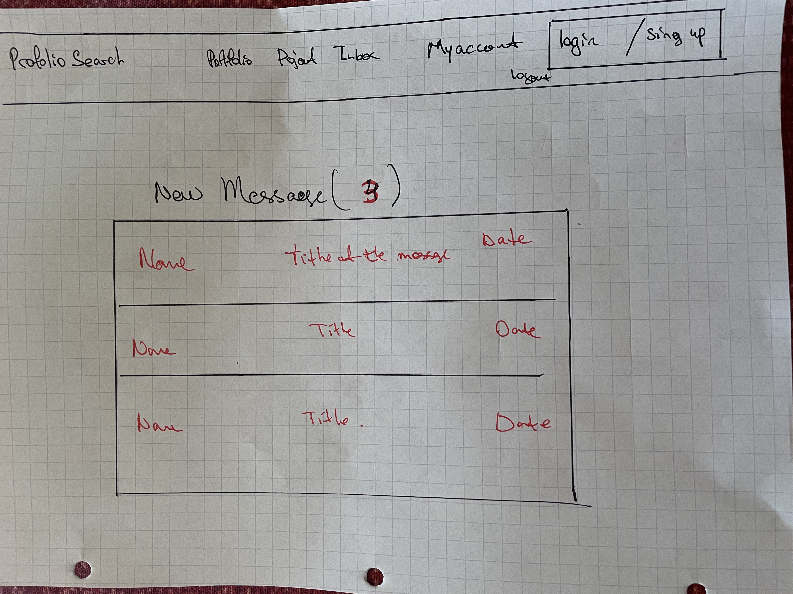
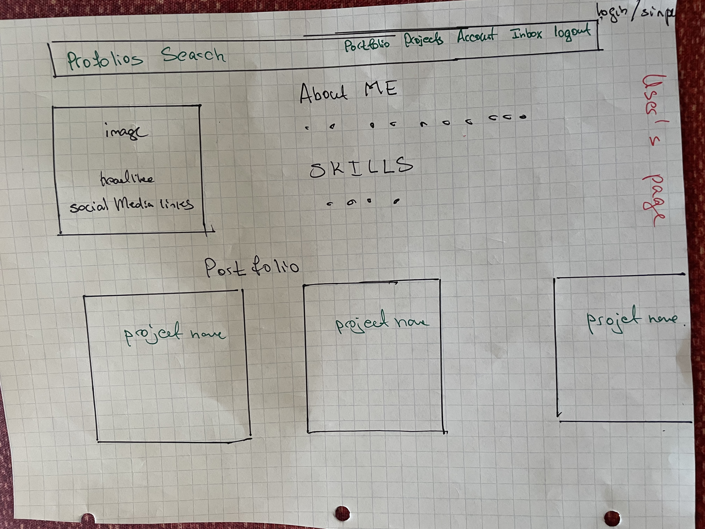

Name : "Profolios" - 
Online directory for purpose of exposure of user’s portfolio. 

Content & User’s Story:

Ability to create and share portfolios, message other members to give feedback on their portfolio or rate their work. As well as search a member or particle portfolio by name. 

Features:
Search bar functionality. 
Authentication, Login and Logout pages.
Create account. 
User ‘s Registration, receiving welcome email after registration. 
Restrict users that are not logged in. 
Reset Password. 
Update profile (image, bio).
Add or delete project, add skill. 
Post feedback. 
Write a message to user. 
Read and Delete message. 

Stretch Features: Building API, Serializing data.

Home page will showcase users’ portfolios, also will have a search bar to search user by name or a skill and Nav bar to navigate other pages.
Login/Logout and registration page.
Once user registers automatically will be logged in. 
User page will have picture, social links, about me, skill, and links of the portfolio’s project. (Similar to resume). 
Portfolio’s project page will have navigation life link to a project, as well as description of about the project such as development tools etc.. 
User can comment the portfolio. 
User can modify their profile by updating deleting or creating images, skills, projects etc.. 

User also will able to receive a message, which will be accessed on their own account, user will able to read and delete the message. (I am not sure about the messaging yet this could be stretch feature.)

ERD is one to many. (Planning to create category if I do so I will have many to many relationships.)

Development Tools:
       Django, python, posgraSQL.
(not sure yet but possible – API with Django REST Framework (DRF) ) 

Wireframes: (submitting drawing by hand having a computer issue.)  Sorry. 

 

