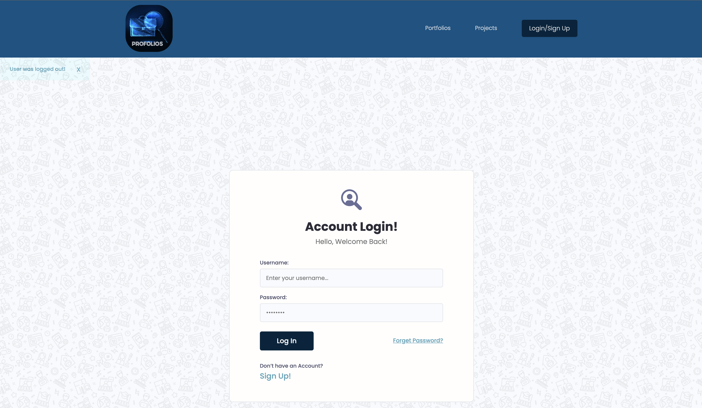
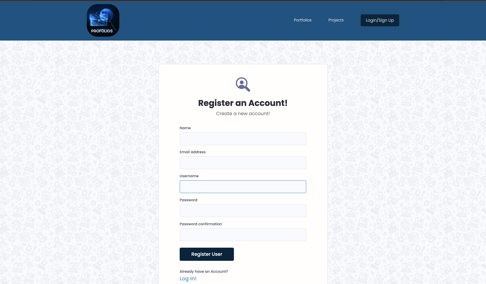

## Introduction: "Profolios"
  - Online directory for purpose of exposure
of user’s portfolio.

## Features:

Ability to create and share portfolios, as well as search a member or particle portfolio by name.
Search bar functionality.
Authentication, Login and Logout pages.
Create account.
User ‘s Registration.
Restrict users that are not logged in.
Update profile (image, bio).
Add or delete project, add skill.

## Home page
Showcases users’ portfolios, with a search bar to search user by name or a skill and Nav bar to navigate other pages.

## Login/Logout.

## Registration page.

## Development Tools:
 Django, python, postgreSQL.

## Resources:

- Google
- Stack Overflow
- django documentation

## Challenges:

I had problem using a Signals (django built-in sent method). was not properly working to solve a problem I had to use @receiver decorator.

## Future Improvements & Stretch Features:

Reset Password.
Post feedback.
Write a message to user.
Read and Delete message.
Pagination.
Send a Welcome emails.

## Link to hosted application:

https://profolios-portfolio.herokuapp.com/

## Support:

Any concerns or questions? Feel free to contact: profolios@gmail.com
